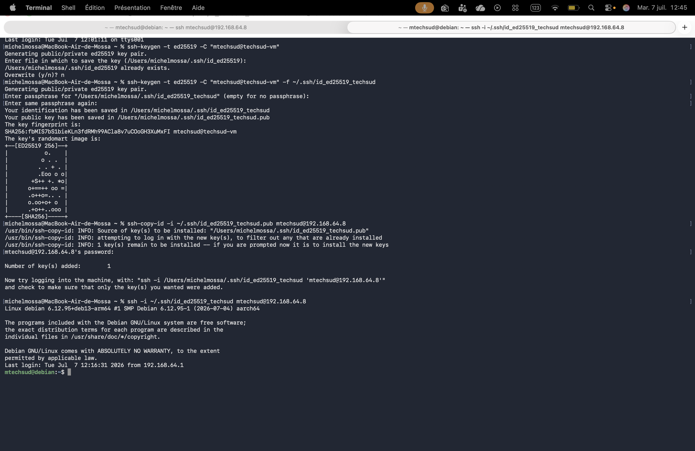
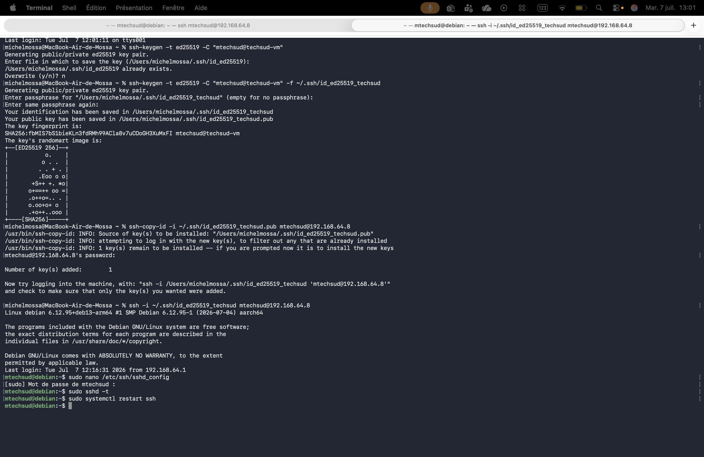
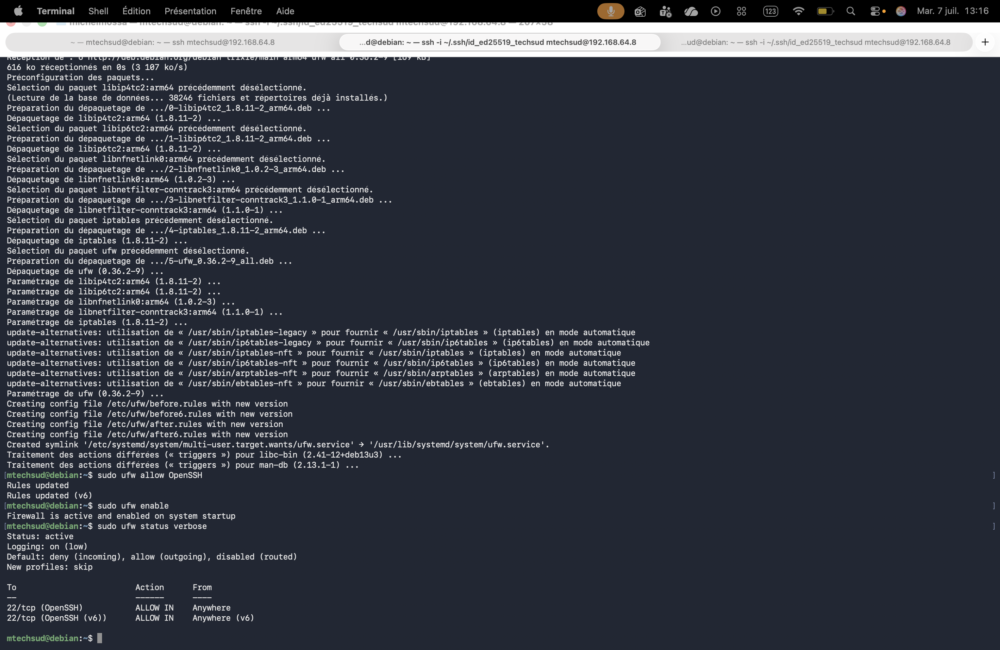
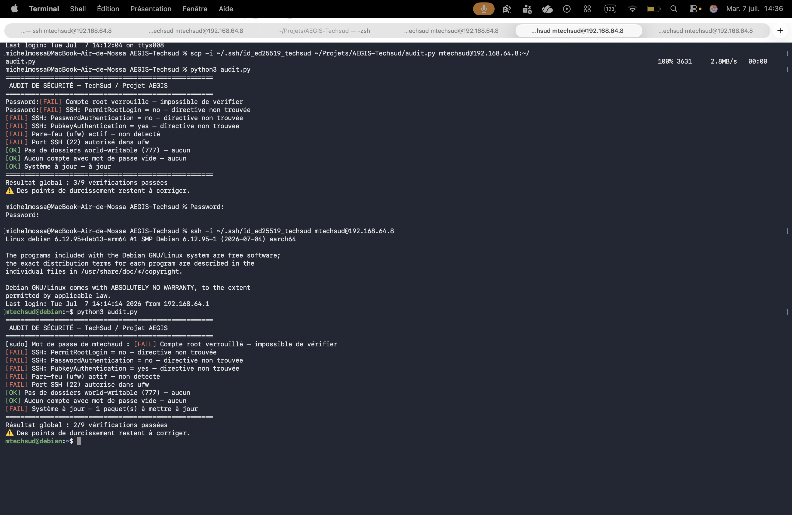
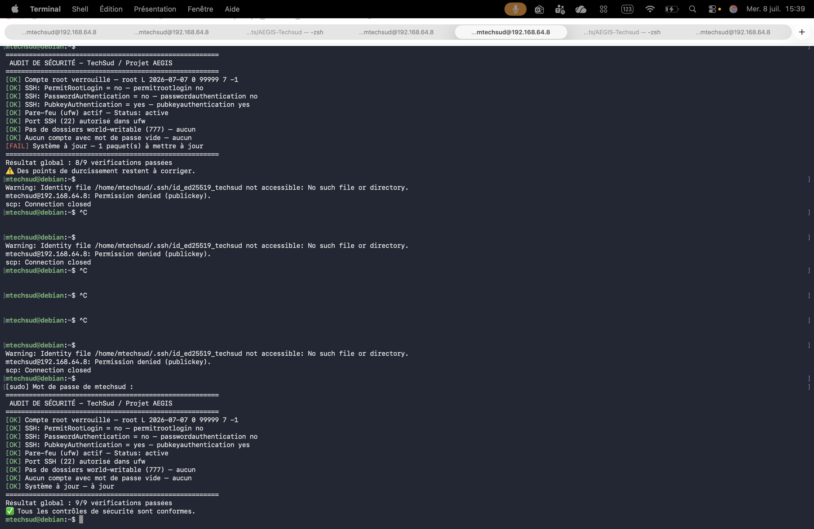

# AEGIS-Techsud - Audit et Durcissement Système

Ce projet contient le script d'audit de sécurité automatisé pour valider le durcissement d'une VM Debian 12, ainsi que les fichiers de configuration associés.

## 📂 Structure du Projet
* `scripts/` : Contient le script de vérification `audit.py`.
* `config/` : Fichiers de configuration récupérés sur la VM (ex: `sshd_config`).
* `docs/images/` : Captures d'écran justifiant la mise en œuvre des contre-mesures.

## 🛡️ Points de Durcissement Validés
1. **Accès Root** : Compte root verrouillé.
2. **Configuration SSH** : Désactivation du login root, interdiction de l'authentification par mot de passe, clé Ed25519 obligatoire.
3. **Pare-feu (UFW)** : Activé et configuré pour restreindre les flux au strict minimum.

---

## 📸 Preuves Étape par Étape

### 1. Sécurisation des accès (SSH)
* Connexion SSH réussie et sécurisée par paire de clés :

### 2. Configuration et activation du Pare-feu (UFW)
* Installation et activation globale du pare-feu sur Debian :

* Ouverture stricte du port SSH (22/tcp) pour éviter les blocages :

### 3. Automatisation de l'Audit
* Historique des tests de robustesse et exécution du script `audit.py` :

* Validation finale du durcissement système (9/9 contrôles conformes) :
